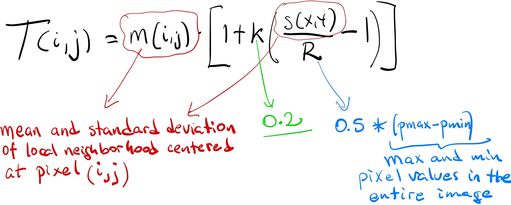

# Homework Assignment 1 (due Sep 18th)

The goal of this assignment is to provide a review of basic tasks using `C++`, such as, processing command line arguments, reading/writing files, manipulating data with arrays and matrices, and using an object oriented design.  The assignment is worth a total of 100 points. If you have any questions or need any help, please visit us during office hours and/or post questions on Piazza.

> If you need to post any of your actual source code on Piazza for any reason, **please** be sure to tag the post as being *visible to instructors only*, so that you don't inadvertently share code with others and violate class rules on *plagiarism*.

## Image Binarization
---

In computer vision, *image binarization*, a.k.a. *thresholding* is the process of taking a grayscale image and converting it into a black and white image.  In grayscale images, every pixel represents an intensity (integer) value ranging 0 (black) to 255 (white).  In black and white images, every pixel is either 0 or 255.  Intensity refers to the brightness of a color, white is the brightest and therefore the most intense, black is the darkest and the least intense.  The figure below shows an example of image binarization:


### Global Thresholding
---

The process of image binarization can be done by comparing each pixel within the input image against a predefined threshold `T`, and deciding whether each individual pixel gets turned white or black .  Pixels whose intensity is less `T` become black, all others become white.  The algorithm below shows how to binarize an image.

```text
input: Image A (grayscale)
output: Image B (black and white)

calculate global T
for each pixel A[i][j] in A do
    if A[i][j] < T then
        B[i][j] = 0
    else
        B[i][j] = 255
    endif
endfor
```

The value of `T` can be provided by the user, or be automatically calculated by using an algorithm.  For example, `T` can be the average intensity, or the median of all pixels.  There are hundreds of different ways for calculating `T`, often involving statistical measures.  As you can imagine, the choice of `T` has strong implications on the quality of the final image, which is also dependant on the complexity of the image.  Some methods will work well only with certain images.

> For the purpose of this assignment, a global value of `T` must be calculated using the `median` value of all pixels in the input image

### Local Thresholding
---

While global thresholding uses a constant threshold `T` for transforming each pixel in an image, the idea behind local thresholding is to transform pixels by only considering the surrounding area, i.e., the local neighborhood of pixels.  The neighborhood of a pixel `p` is a small matrix of dimensions `d x d` centered at `p`.  In this case, for each pixel in the image, we are basically calculating a different `T`.  The algorithm below shows how to binarize an image.

```text
input: Image A (grayscale)
output: Image B (black and white)

for each pixel A[i][j] in A do
    calculate T[i][j]
    if A[i][j] < T[i][j] then
        B[i][j] = 0
    else
        B[i][j] = 255
    endif
endfor
```

As an illustration, the figure below shows an example of applying local thresholding.  The example uses the `median` as the metric for deciding the new value of a pixel.

> Note that pixels at the edges, where the neighborhood is not a perfect fit, do not consider pixels out-of-bounds as part of the neighborhood.


## Your Task
---

Your goal in this assignment is to develop a command line tool that performs image binarization, given some options provided by the user of your tool. 

### Command Line Arguments

Your program must accept the following command line arguments:
```text
<type>      either 'local' or 'global'
<in_fname>  name of the input file
<out_fname> name of the output file
[<size>]    size of the neighborhood
```
The last argument is optional, and must be provided **only** when `<type>` is `'local'`.  For example, see below a few examples of how to use your tool.  Note that the correct order of command line arguments is very important.
```text
$ ./binarizer global cover.img cover_glo.img
$ ./binarizer local cover.img cover_loc_5.img 5
$ ./binarizer local cover.img cover_loc_7.img 7
$ ./binarizer local cover.img cover_loc_15.img 15
```

1. The value of `T` for global thresholding must be the `median` of all pixels
2. The value of `T[i,j]` for local thresholding must be `adib`, given by the formula below.  This formula is from the paper *Adaptive document image binarization* by Sauvola and PietikaKinen, 2000.



### Image file format

Each image is encoded as a matrix of pixel values.  Internally you can represent an image either as a bidimensional array, or as an unidimensional array and design your algorithms properly.  When loading or saving files, each image file must be a `text file` where pixels values are separated by a single whitespace, and organized in `n` rows and `m` columns (the image dimensions).  For example, here is one file with 10 rows and 8 columns.
```
121 24 149 1 173 251 10 38 
97 137 153 92 40 93 9 149 
138 136 128 18 66 109 16 138 
185 218 67 3 194 155 186 255 
131 50 188 128 120 193 104 144 
39 109 228 155 131 42 133 93 
75 148 197 137 26 198 0 226 
43 85 167 158 28 207 17 165 
14 150 49 205 79 86 216 8 
88 78 159 41 66 227 84 80 
```
> Note that every pixel value is separated by a **single** whitespace.  There should not be any trailing whitespaces.

## Submission and Grading
---

Your submission will be tested and graded by an autograder, for this reason it cannot be stressed enough that your program must *exactly* follow the specifications for input and output upon submission.  Please use `main.cpp ` as the single name for your program.  We expect you to design your own **functions** and **classes** to model this problem, and all should be within the same file.  Your program will be compiled with the following line:

```bash
$ g++ -std=c++11 -Wall main.cpp -o prog
```

> For all your calculations, you are required to use `double` as the default datatype for the pixels and the terms in all formulas, this is necessary to obtain a final image consistent with the autograder.

To submit your solution to Gradescope, simply select `main.cpp` and use the `drag and drop` option.

> You must be reminded that students caught cheating or plagiarizing will receive `no credit`. Additional actions, including a failing grade in the class or referring the case for disciplinary action, may also be taken.
