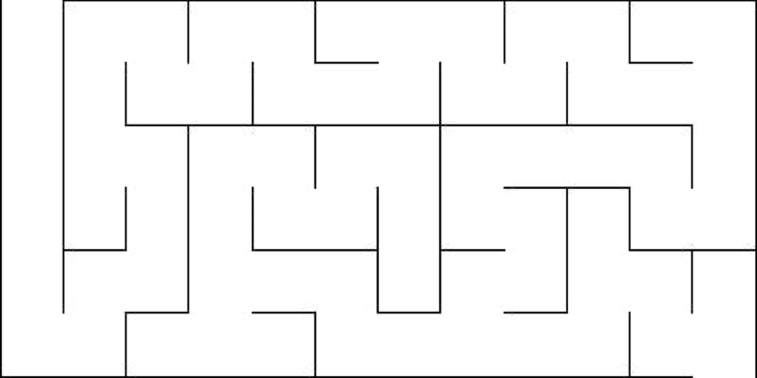
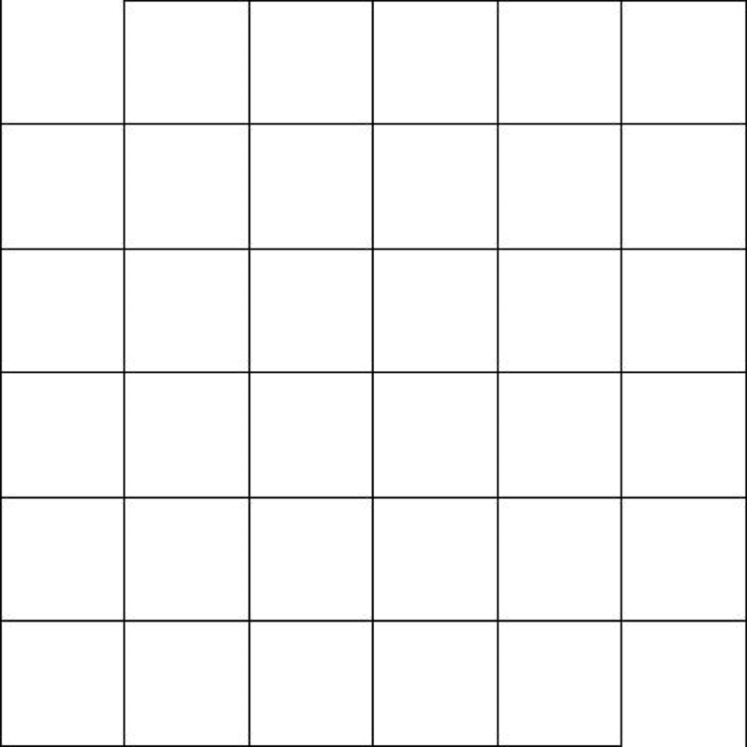
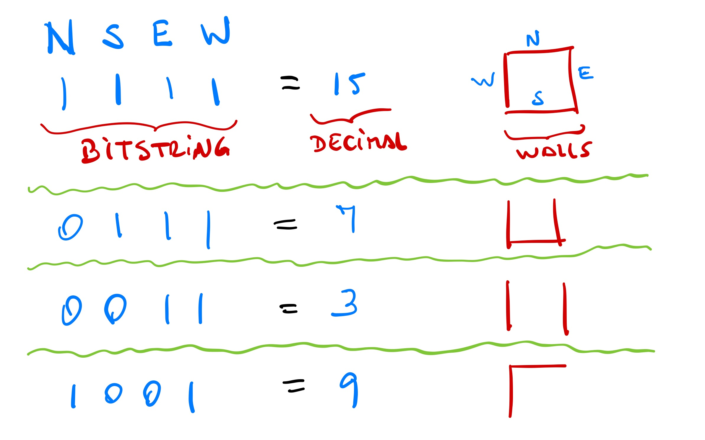
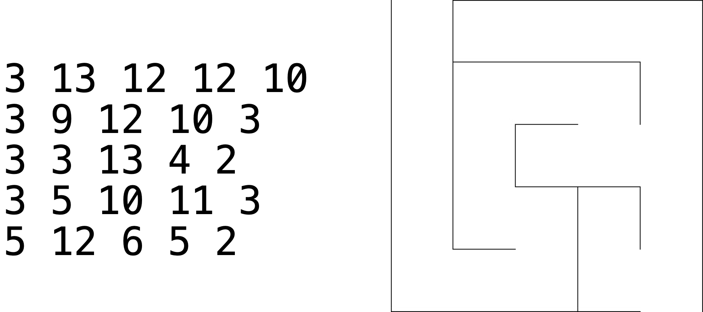

# Homework Assignment 2 (due Oct 2nd)

The goal of this assignment is to review the use of *classes* and *dynamic arrays* in `C++`, both in the context of a *maze generation* application.  The assignment is worth a total of 120 points. If you have any questions or need any help, please visit us during office hours and/or post questions on Piazza.

> If you need to post any of your actual source code on Piazza for any reason, **please** be sure to tag the post as being *visible to instructors only*, so that you don't inadvertently share code with others and violate class rules on *plagiarism*.

## What is a Maze?
A maze is a puzzle, with starting and ending points, in which a player is tasked to find a path connecting an starting point to an ending point.  Many algorithms for automatically generating random mazes have been proposed.  In this assignment we will implement a *randomized depth-first search* approach that uses *dynamic arrays*.  For the context of this assignment, every maze is two-dimensional and it only contains 1 starting and 1 ending cell.  There should be exactly one path connecting both cells.  The example below illustrates a random maze of dimensions `n=6, m=12`, `n` rows and `m` columns.  Note that the starting point always happens at cell `0, 0` and the ending point at `n-1, m-1`.



## Maze Generation
A data structure for representing a maze in memory may be a two dimensional array in which every cell encodes whether each of the 4 walls is closed or open.  We can assume each cell has 4 walls: `north`, `south`, `east`, and `west`.

The algorithm for generating a maze starts with a grid where only 2 walls are removed, `north` for the starting position, and `south` for the ending position, as illustrated in the 6x6 grid below.



A common approach for maze generation involves removing interior walls iteratively.  At each iteration a wall is removed to connect two adjacent cells.  This iterative process must follow these rules:

- walls to be removed should be selected randomly. Use [`std::rand()`](https://en.cppreference.com/w/cpp/numeric/random/rand) to generate random numbers and [`std::srand()`](https://en.cppreference.com/w/cpp/numeric/random/srand) to provide a seed to the random number generator
- there should be exactly one path connecting the starting and ending cells
- every cell must be reachable from the starting cell

The algorithm below should be followed in your implementation.  This is not the most efficient way to solve the problem of maze generation, however it is easy to understand and can be implemented with the support of simple data structures such as dynamic arrays (`std::vector` in `C++`).  

> We **strongly suggest** you to trace this algorithm on paper using a small example (e.g. a 4 x 4 grid) until you fully understand how it works, before starting to code.

```text
create empty dynamic array A
mark cell [0,0] as visited
insert cell [0,0] at the end of `A`
while `A` is not empty
    `current` <- remove last element from `A`
    `neighbors` <- `current`'s neighbors not visited yet
    if `neighbors` is not empty
        insert `current` at the end of `A`
        `neigh` <- pick a random neighbor from `neighbors`
        remove the wall between `current` and `neigh`
        mark `neigh` as visited
        insert `neigh` at the end of `A`
    endif
endwhile
```

> In order to match the autograder tests, picking a random neighbor **must** follow this procedure: "check the neighbors of a cell in N-S-E-W order and **append** the ones that were not visited yet into an empty vector `neighbors`, then use the index `idx` below to pick a random neighbor with `neighbors[idx]`"

```c++
idx = std::rand() / ((RAND_MAX + 1u) / neighbors.size());
```

## Your Task

Your goal in this assignment is to develop a command line tool that will generate a random maze, given some options provided by the user. 

### Command Line Arguments

Your program must accept the following command line arguments:

```text
<seed>  the seed value for the random number generator
<N>     number of rows in the grid N > 0
<M>     number of cols in the grid M > 0
<fname> file name for the output
```

> The `seed` argument is very important as it initializes the random number generator.  If you change the seed, you will generate a different maze.  In your code make sure you call this function exactly once before generating the maze:

```c++
std::srand(seed);
```

The last argument will be used to save the generated maze into a text file.  Note that you can provide any value as `fname`.  See the example below:

```text
$ ./generator 0 10 10 example.txt
```

### Maze file format

The file format for saving the maze is just a two dimensional array of integers, where each integer is used to represent a cell and its walls.  Each integer in the matrix ranges from 0 to 16.  The idea behind this representation is that the walls are encoded using 4 bits, and the ingeters are just their corresponding values in decimal notation.  The figure below illustrates the encoding:



When saving the grid, the output file must be a `text file` in which cell values are separated by a single whitespace, and organized in `n` rows and `m` columns (the grid dimensions).  For example, the image below shows one grid with 5 rows and 5 columns.  The text file representation of the grid appears on the left, and the corresponding maze appears on the right.  Note how each number maps into a cell encoding its walls.  We prepared a script that can help you test your program by creating a visualization of your grid, for more details please refer to [this document](./conversion).



> Note that every integer value is separated by a **single** whitespace.

## Submission and Grading

Your submission will be tested and graded by an autograder, for this reason it cannot be stressed enough that your program must follow the specifications for input and output upon submission.

You are **required to design a class for the grid** and submit exactly three files:

- `maze.h`: class declaration
- `maze.cpp`: implementation of all methods defined in `maze.h`
- `main.cpp`: driver program that takes CLAs and uses the class `Maze` to generate output

Your program will be compiled with the following line:

```bash
$ g++ -std=c++11 -Wall main.cpp maze.cpp -o generator
```

To submit your solution to Gradescope, simply select the three required files and use the `drag and drop` option.

> :heavy_exclamation_mark: You must be reminded that students caught cheating or plagiarizing will receive `no credit`. Additional actions, including a failing grade in the class or referring the case for disciplinary action, may also be taken.
