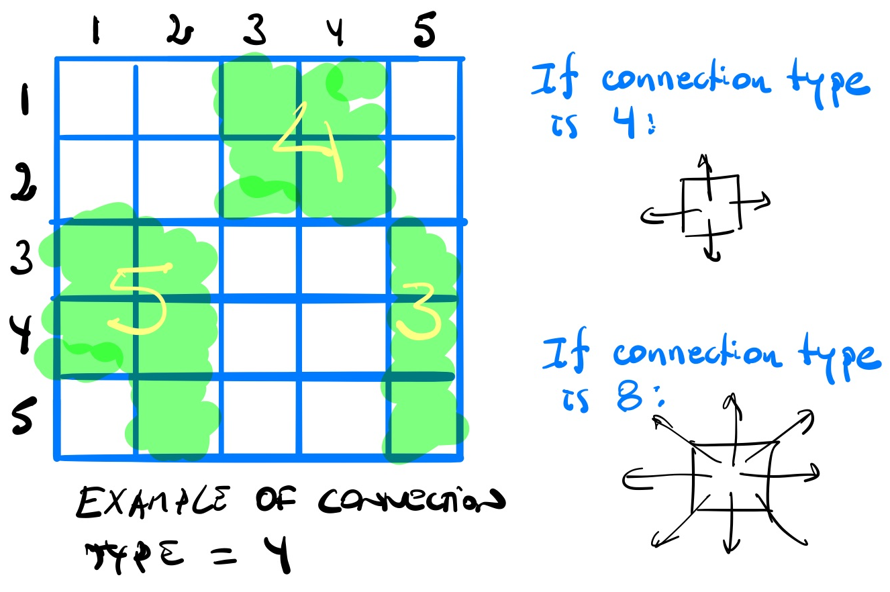

# Homework Assignment 4 (due Nov 6th)

The goal of this assignment is to practice recursion and stacks.  The assignment is worth a total of 120 points, from which 20 are extra/bonus points.  The assignment can be completed individually or in teams of 2 students.  If you have any questions or need any help, please visit us during office hours and/or post questions on Piazza.

> If you need to post any of your actual source code on Piazza for any reason, **please** be sure to tag the post as being *visible to instructors only*, so that you don't inadvertently share code with others and violate class rules on *plagiarism*.

## `1. Counting Cells (20 pts)`
Consider a grid of cells in two dimensions, where each cell is considered `empty` or `filled`.  Any number of cells that are *connected* constitutes a `blob`.  Every cell can either be connected to 4 adjacent cells (vertically, horizontally) or to 8 adjacent cells (vertically, horizontally, diagonally).  The goal of your program is to **recursively** count the number of cells in a blob, given a starting cell.



### Input
Your program will receive the following command line arguments:
```text
<fname> File name for the grid of cells
<M>     Number of rows in the grid
<N>     Number of columns in the grid
<X>     Row of the starting cell
<Y>     Column of the starting cell
<CONN>  Connection type. Can be either `4` or `8`
```

Assume that grid rows are numbered `1` through `M` from top to bottom, and columns are numbered `1` through `N` from left to right. `2 <= M,N <= 100`.

The line below shows an example of using your program:
```bash
$ ./cells grid.txt 8 8 3 4 4
```

### Output
Given a starting cell, your program should write the count of cells to the standard output.  For example, considering the input file below:

```text
0 0 0 1 1 1 0 0
0 0 0 1 1 1 0 0
0 0 0 1 1 1 0 0
1 1 1 0 0 0 0 0
1 1 1 0 0 0 0 0
0 0 0 1 1 1 0 0
1 1 0 1 1 1 0 0
1 1 0 1 1 1 0 0
```

Your program should output the following values:
```bash
$ ./cells grid.txt 8 8 3 4 4
9
$ ./cells grid.txt 8 8 5 2 4
6
$ ./cells grid.txt 8 8 3 4 8
24
$ ./cells grid.txt 8 8 5 2 8
24
```

## `2. Counting Blobs (20 pts)`
Consider the same grid specification from the problem above, the goal of your program now is to count the total number of blobs.

### Input
Your program will receive the following command line arguments:
```text
<fname> File name for the grid of cells
<M>     Number of rows in the grid
<N>     Number of columns in the grid
<CONN>  Connection type. Can be either `4` or `8`
```

Assume that grid rows are numbered `1` through `M` from top to bottom, and columns are numbered `1` through `N` from left to right. `2 <= M,N <= 100`.

The line below shows an example of using your program:
```bash
$ ./blobs grid.txt 8 8 4
```

### Output
Your program should write the count of blobs in the grid to the standard output.  For example, considering the input file below:
```text
0 0 0 1 1 1 0 0
0 0 0 1 1 1 0 0
0 0 0 1 1 1 0 0
1 1 1 0 0 0 0 0
1 1 1 0 0 0 0 0
0 0 0 1 1 1 0 0
1 1 0 1 1 1 0 0
1 1 0 1 1 1 0 0
```

Your program should output the following values:
```bash
$ ./blobs grid.txt 8 8 4
4
$ ./blobs grid.txt 8 8 8
2
```

## `3. Finding a Good Path (30 pts)`
Given a 2-dimensional grid representing elevations of a map, determine the lowest and highest points and whether there is a path between them that never goes down.  This problem is a slightly modified version of one of the problems in the [BOSPRE 2018](http://hc3.seas.harvard.edu/hc3/bospre/) competition.

### Input
Your program will receive the following command line arguments:
```text
<fname> File name for the 2-dimensional map
<M>     Number of rows
<N>     Number of columns
```

Assume that grid rows are numbered `1` through `M` from top to bottom, and columns are numbered `1` through `N` from left to right.  `5 <= M,N <= 100` and each elevation in the grid is  `0 <= E <= 100`.

The line below shows an example of using your program:
```bash
$ ./path map.txt 5 5
```

### Output
Your program should write 5 values to the standard output: `Lr Lc Hr Hc YESNO` where `Lr Lc` are the row and column of the lowest point in the grid, `Hr Hc` are the row and column of the highest point in the grid, and `YESNO` is the word: `yes` if there is a path from the lowest point to the highest point that never goes down and `no` if there is no such path.  Specifically, the path starts at the lowest point and can only go from a point to one of its 4-neighbors (left, right, up, or down) that does **NOT** have a lower elevation than the point.  Input will be such that there is a unique solution.

For example, considering the input file below:
```text
2 3 3 4 5
2 4 4 1 4
2 1 0 2 1
4 2 1 3 4
3 1 2 2 3
```

Your program should output the following values:
```bash
$ ./path map1.txt 5 5
3 3 1 5 yes
```

An additional example is shown below:
```bash
2 3 3 4 5
3 4 4 1 4
2 1 0 2 1
4 2 1 3 4
3 1 2 2 3
```

Your program should output the following values:
```bash
$ ./path map2.txt 5 5
3 3 1 5 no
```

## `4. Arithmetic Expressions`
An arithmetic expression is defined as a sequence of tokens delimited by whitespaces.  Tokens can be *operators*, *numbers*, and *left/right parentheses*.  For the purposes of this assignment, the following operators are considered:

- `-` subtraction and `+` addition
- `*` multiplication and `/` division (performs **integer division**)
- `^` exponentiation (exponent will always be >= 0)

The list above shows operators in order of precedence from lower to higher.  Operators with the same precedence occurring in an expression should be evaluated from left to right (left associativity), with the exception of `^` which is **right-associative**.  For example `5 - 2 + 3` (subtraction is evaluated before the addition) should evaluate to `6`, and `2 ^ 3 ^ 2` should evaluate to `512` (the second operator is evaluated before the first).

Each number in an arithmetic expression is an integer number that may contain multiple digits and may be positive or negative.  For example, `3 345 -129 0 +321 321 -1` are all valid numbers.

>You can assume that all arithmetic expressions have no leading and trailing whitespaces, and all tokens are separated by exactly 1 whitespace.

### Infix Notation
Corresponds to the usual way to write arithmetic expressions, in which every operator appears between two operands.  More formally, an infix expression is recursively defined as follows:

```text
1. any number is a valid infix expression
2. if E is an infix expression, then '( E )' is an infix expression
3. if E1 and E2 are infix expressions, and OP is an operator, then 'E1 OP E2' is an infix expression
```

### Postfix Notation
Corresponds to arithmetic expressions in which every operator follows its operands.  More formally, a postfix expression is recursively defined as follows:

```text
1. any number is a valid postfix expression
2. if P1 and P2 are postfix expressions, and OP is an operator, then 'P1 P2 OP' is a postfix expression
```

Parentheses are not necessary in postfix expressions because the order of operations is given by the order of operands and operators (from left to right).  The table below shows several examples of equivalent infix and postfix arithmetic expressions.

| Infix Expression | Postfix expression | Result |
|------------------|--------------------|--------|
| 1 + 2 | 1 2 + | 3 |
| -10 + 20 * ( 30 / 2 ) | -10 20 30 2 / * + | 290 |
| ( 5 + 3 ) * 12 / 3 | 5 3 + 12 * 3 / | 32 |
| 33 + 12 - 12 / ( 4 * -9 ) | 33 12 + 12 4 -9 * / - | 46 |
| 1 + 2 - 3 * 4 / 5 ^ 6 | 1 2 + 3 4 * 5 6 ^ / - | 3 |

> Note that, in this assignment, we define an integer division as a floor division.  That explains why in the table above 12 / -36 is evaluated to -1, as `floor(-0.333333) = -1`.

### `Transforming Infix to Postfix notation (30 points)`
You will implement a program that converts arithmetic expressions from infix notation to postfix notation.  Your program will receive an infix expression as the first command line argument and will output the equivalent expression in postfix notation to the standard output.  You can assume that all infix expressions are syntactically correct.  See the example below:
```bash
$ ./in2pos "-10 + 20 * ( 30 / 2 )"
-10 20 30 2 / * +
```

The algorithm for transforming an infix expression into a postfix expression can be implemented using a stack of operators/parentheses.  Start with an initially empty stack.  Scan tokens from left to right and follow the rules below:

```text
if left parenthesis
    push it onto the stack
if operator
    pop and write to the output string all consecutive operators that are either operators of higher precedence; or left-associative operators of equal precedence
    push the operator onto the stack
if right parenthesis
    pop and write to the output string all operators until a left parenthesis is popped off the stack
if number
    it may be immediately written to the output string
if end of the string
    pop and write to the output string all operators until the stack is empty
```

A few examples of this conversion are available in [examples 1](https://cs.nyu.edu/courses/Fall12/CSCI-GA.1133-002/notes/InfixToPostfixExamples.pdf) and [examples 2](https://en.wikipedia.org/wiki/Shunting-yard_algorithm).

### `Evaluating a postfix expression (20 points)`
Implement a program that evaluates an arithmetic expression in postfix notation.  Your program will receive a postfix expression as the first command line argument and will output the final value after *evaluating* the input expression.  You can assume that all input expressions are syntactically correct.
```bash
$ ./eval "-10 20 30 2 / * +"
290
```

The algorithm for evaluating a postfix expression can be implemented using a stack of numbers.  Start with an initially empty stack.  Scan tokens from left to right and follow the rules below:

```text
if number
    push it onto the stack
if operator
    pop two numbers (operands) from the stack, evaluate the operator on those numbers and push the result back to the stack
if end of the string
    pop the number from the stack and return it
```

## Submission and Grading
You will submit five files named `cells.cpp`, `blobs.cpp`, `path.cpp`, `in2pos.cpp`, and `eval.cpp`.  Each file/program should include its own `main` function.  You are required to provide meaningful comments in all your functions and use proper coding style and indentation.  Your submission will be tested and graded by an autograder, for this reason it cannot be stressed enough that your program must follow the specifications for input and output upon submission.  For each of the questions you either pass the test cases (full points) or not (zero points).  To submit your solution to Gradescope, simply select the three required files and use the `drag and drop` option.

> :heavy_exclamation_mark: You must be reminded that students caught cheating or plagiarizing will receive `no credit`. Additional actions, including a failing grade in the class or referring the case for disciplinary action, may also be taken.
