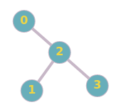
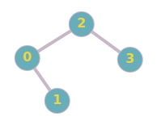
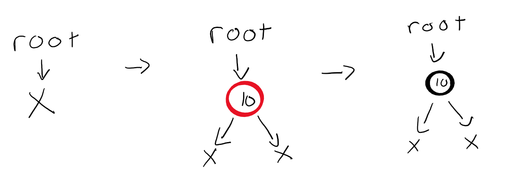
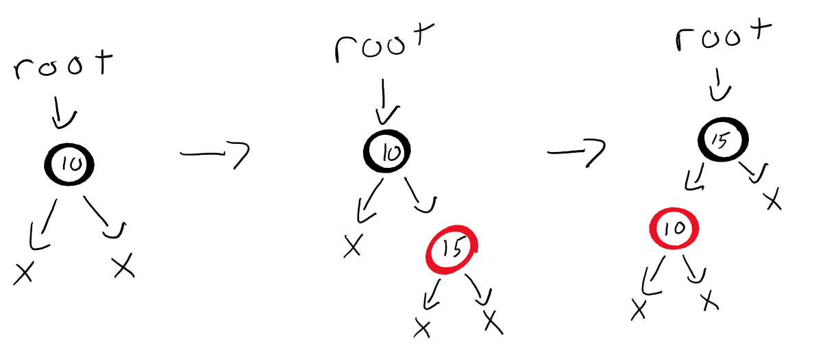
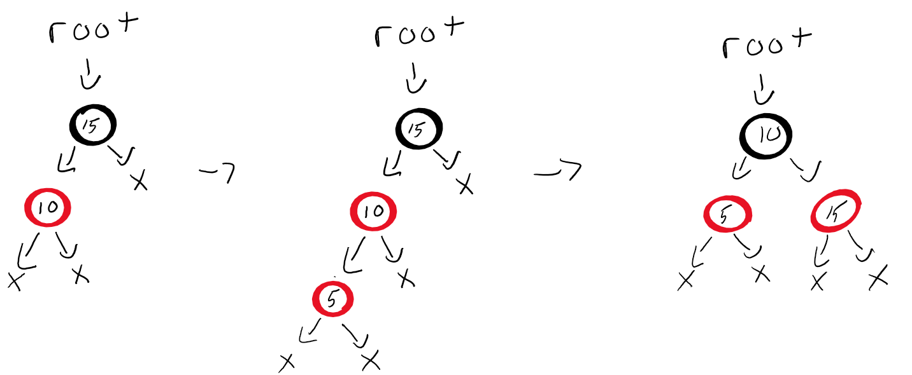
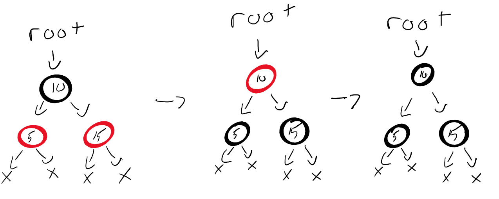

# Lab-10 Balancing Act

## 1. Introduction

Today you will be turning a regular Binary Search Tree into a Balanced Binary Search Tree. Don't worry about having to implement a tree class all over again; this time we have provided you with a working implementation. All you have to do is modify the `insert` method to allow for balanced insertions, as well as add any additional helper functions you need. First we will go over what it means for a BST to be balanced, then some different implementations for balancing, and finally the starter code.

## 2.0 Balanced Binary Search Trees

#### Why do we need to balance?

Binary search trees are a nice idea, but they fail to accomplish our goal of doing lookup, insertion and deletion each in time O(log2(n)), when there are n items in the tree. Imagine starting with an empty tree and inserting 1, 2, 3 and 4, in that order.

     1      1        1           1
             \        \           \
              2        2           2
                        \           \
                         3           3
                                      \
                                       4

You do not get a branching tree, but a linear tree. All of the left subtrees are empty. Because of this behavior, in the worst case each of the operations (lookup, insertion and deletion) takes time Θ(n). From the perspective of the worst case, we might as well be using a linked list and linear search. 

#### Balancing

When to balance a BST is generally based on the height of it's sub-trees. A node will be unbalanced if the heights of its sub-trees differ by more than 1. A tree will be *height-balanced* if all of its nodes are balanced. 

**Example of unbalanced tree:**


Notice how the node with value `76` in the right sub-tree has a left sub-tree of height 3, but a right sub-tree of height 0. Notice the same discrepancy in the left sub-tree at node with value `9`. Both of these problems are grounds for balancing.

**Example of tree after balancing:**


Notice the heights of the sub-trees in the balanced version above, they only ever differ by 1, thus they pass our height requirement. Also notice the differing arrangement of nodes: the node with value `12` is now the parent of nodes `9` and `14`, the node with value `72` is now the parent of nodes `54` and `76`. We performed swaps on nodes based on their values and the heights of sub-trees. 

#### Rotations

We've seen why we need to Balance Binary Search Trees, when to balance them, and what an unbalanced tree versus a balanced tree looks like, but how do we perform the swaps necessary to achieve the correct result? 
In the examples above, the trees were balanced by using rotations. If the height of a left sub-tree is greater than or equal to the height of the right sub-tree plus 2, then we perform a right rotation. Inversely, if the height of a right sub-tree is greater than or equal to the height of the left sub-tree plus 2, then we perform a left rotation. 

Heights of left sub-tree = L and right sub-tree = R

If L >= (R + 2) then rotate right.
If R >= (L + 2) then rotate left.

**Example of Rotate Left Function**

```C++
RBTNode* RBTree::rotateLeft(RBTNode* root){
    RBTNode* p = node->right;
    node->right = node->right->left;
    p->left = node;
    return p;
}
```
The above `rotateLeft` method would turn this tree:



In to this tree:



## 3.0 Red-Black Trees


**Definition of a red-black tree**

A red-black tree is a binary search tree which has the following red-black properties:
<ul>
    <li>Root is always black</li>
    <li>Every node is either red or black.</li>
    <li>Every leaf (NULL) is black.</li>
    <li>If a node is red, then both its children are black.</li>
    <li>Every simple path from a node to a descendant leaf contains the same number of black nodes.</li>
</ul>

#### Insert Operation

 The goal of the insert operation is to insert key K into tree T, maintaining T's red-black tree properties. A special case is required for an empty tree. If T is empty, replace it with a single black node containing K. This ensures that the root property is satisfied.

If T is a non-empty tree, then we do the following:

<ol>
    <li>Use the BST insert algorithm to add K to the tree</li>
    <li>Color the node containing K red</li>
    <li>Restore red-black tree properties (if necessary)</li>
</ol>


> [Source](http://pages.cs.wisc.edu/~paton/readings/Red-Black-Trees/)

## 3.1 Left-Leaning Red-Black Trees


#### Definition of a left-leaning red-black tree

A left-leaning red-black tree is an easier variant of the red-black tree to implement, while still guaranteeing search/delete/insert operations in O(log n) time. The properties of the left-leaning red-black tree are the same as the regular red-black tree, but we change up the insertion rules a bit.

The first insert works the same:



- If a node has a BLACK LEFT child and a RED RIGHT child, left-rotate the Node & swap colors



- If a node has a RED LEFT child and a RED LEFT grandchild, right rotate & swap colors



- If both LEFT and RIGHT children are RED, invert colors of all 3 Nodes



## 4.0 Starter Code

The starter code consists of RBTree.h (RBTree class definition),  RBTree.cpp (a working implementation of a BST).

### 4.1 Class Contents

In RBTNode:

+ An integer for storing the node's data
+ A RBTNode* which points to a node's left child
+ A RBTNode* which points to a node's right child
+ A base constructor which sets the node's value to 0 and left and right pointer's to null
+ A constructor which sets a given int parameter to the node's value

In RBTree:

* A RBTNode* which points to the root of the RBTree
* A constructor which sets the root pointer to null
* An `insert` method which will need to be reworked to allow for balanced insertion
* A `clear` method which deletes the root node and sets the pointer to null
* `pre/post/inorder` display functions that output `value:color` 
* `rotateLeft` and `rotateRight` function stubs for you to complete

## 5.0 Task

As we have mentioned at length above, the purpose of this lab is to modify the existing insert method to allow for balanced insertions. 

Specifically, we will be implementing a left-leaning red-black tree. You will need to add a variable to the RBTNode class representing node color (I.E. 'true' for red 'false' for black.) You could also use a method `changeColor` to change the color of nodes when necessary if you so choose.

## 6.0 Submission

You will submit RBTree.h and RBTNode.cpp after modifying the insertion method to create a balanced tree. 
