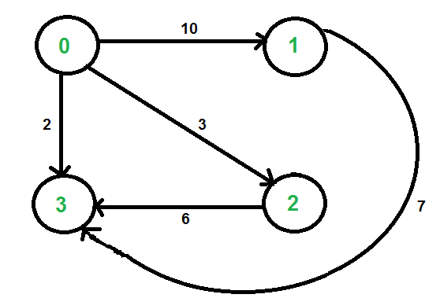
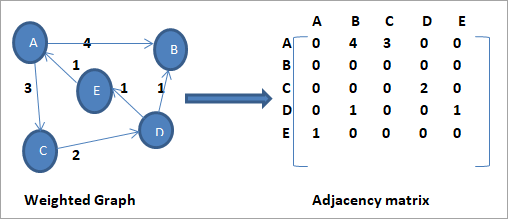
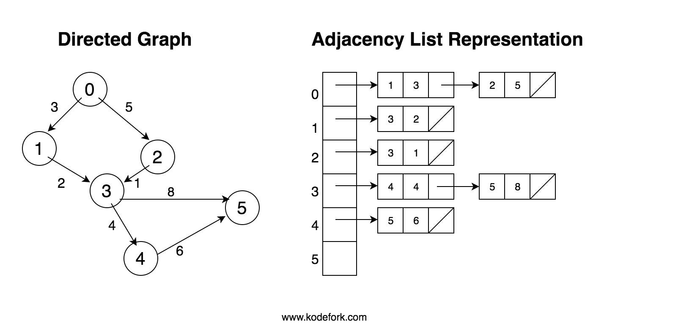
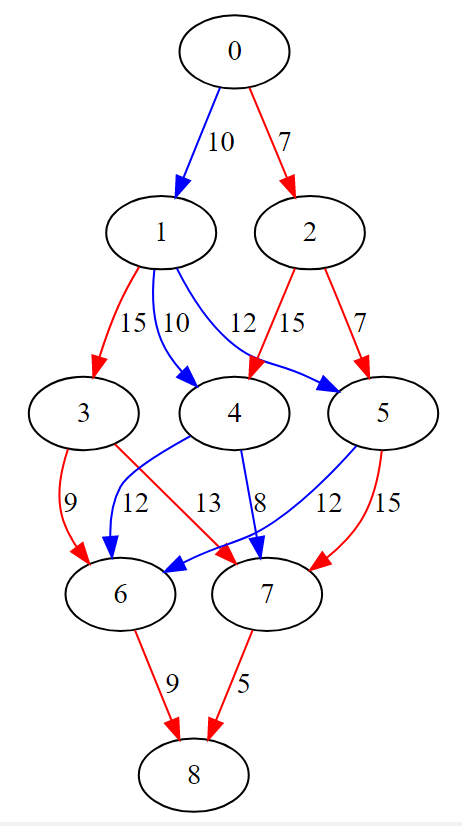
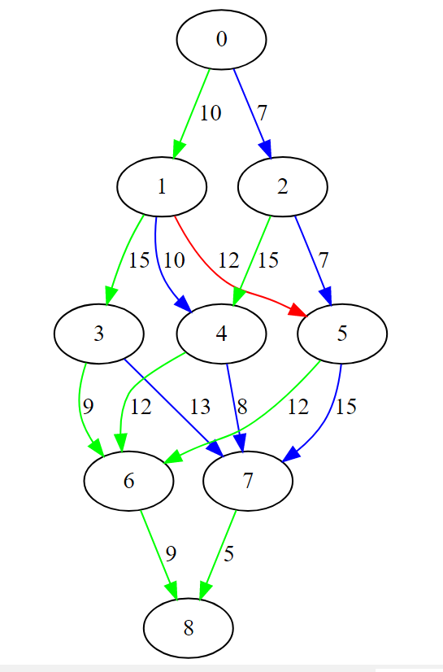
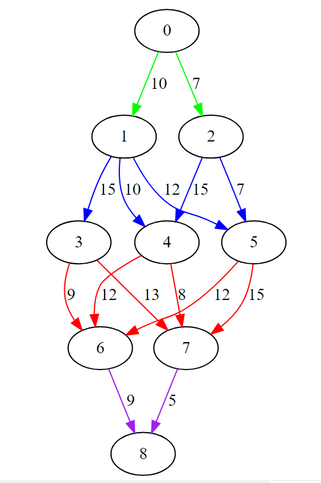

# Lab-11 Graphs

## 1. Introduction

Today you will be given code for a fully functioning graph. Your task will be to write the functions required to traverse said graph & create several visualizations.

## 2.0 Brief Graph Review

As we know, Graphs come in many forms. Today we will be dealing with a Directed Weighted graph. This type of Graph represents connections between Vertices that are unidirectional & have a weight. Here is an example:



We have 4 Vertices (labeled 0 - 3) with each containing an outgoing Edge that points to another Vertex and has a weight attached to it. Notice the arrows on the outgoing edges. They represent the direction we can travel along this edge. We can go from 0 -> 1, but not from 1 -> 0. This graph also tells us that it costs us less to go from 0 -> 3 than it does to go from 0 -> 1.

## 3.0 Representing Graphs in code

"This is great and all, but how do we code this?" you may be asking at this point. Well, there are a few ways to represent the above graph in code. In an Adjacency Matrix, and in an Adjacency List.

### Adjacency Matrix

Lets start with the easier of the two. An Adjacency Matrix represents a graph by storing weights in a VxV matrix. The first dimension represents the Source, while the second dimension resents the Destination.



Looking at this image, we see a weighted directed graph as well as its Adjacency Matrix representation. From Vertex A, we can get to B at a cost of 4, and to C at a cost of 3. Under the matrix's 'A' row, we see the 4 in the 'B' column and the 3 in the 'C' column. All of the relationships given to us in the image is correctly portrayed in the Adjacency Matrix representation. Since these relationships are stored as an array, we can very quickly test for adjacency (a *very* common task.) However, a glaring problem is the amount of wasted space. Look at all of those 0's! While Adjacency Matrices are excellent for storing dense graphs, they unfortunately are not as good at storing sparse graphs.

### Adjacency List

Moving onto the Adjacency List, we now have a structure that stores each Vertex in a vector, and the edges are stored as a list inside of that vector. This saves space, as we do not have to waste memory storing an unknown number of 0s; making them superior in storing sparse graphs.



## 4.0 Starter Code

You are given two separate programs to modify. One dealing with an Adjacency Matrix, and the other with an Adjacency List.

### Adjacency Matrix Code

Here you have a vector of vectors of ints. This gives you a VxV matrix that you can store the edge weights in. All of the functions you will need are given in either a completed form or as a prototype. 

### Adjacency List Code

Here you have a vector of lists of pairs. This translates in English as a vector of Vertices, which each has its own list of pairs. Each pair contains the Vertex being pointed to and the weight. All of the functions you will need are given in either a completed form or as a prototype. 

## 5.0 Visualization

In order to visualize the graphs we are coding, we will be using [the following website](https://dreampuf.github.io/GraphvizOnline/#digraph%20G%20%7B%0A%0A%20%20l1%20-%3E%20l2%3B%0A%20%20l2%20-%3E%20l3%3B%0A%0A%7D).

The .dot format in use is just a text file with specific formatting. Here are the commands you'll need to know:

#### Main code block

```
digraph G {

}
```

#### Display an edge between two nodes

```
<source> -> <destination>
```

#### Give an edge a label

```
[label="<text>"]
```

#### Color an edge

```
[color="<color>"]
```

Here is an example you can copy/paste into Graphviz:

```
digraph G {

	0 -> 1[label="5"][color="red"];
	1 -> 2[label="7"][color="blue"];
    
}
```

## 6.0 Task

Your job will be to solve the following problems for each of the two programs. Most of your functions will be writing to a .dot file, for Graphviz to use in displaying your graphs.

### Adjacency Matrix Tasks

- Finish the 'addEdge()' function
- Finish the 'isAdjacent' function

### Adjacency List Tasks

- Finish the 'isAdjacent' function
- Add edge weights to the given visualization


- Color all edges with even weights blue and odd weights red



- Color all edges based on their position in a vertex's list



- Color all edges based on their distance from the start (Hint: Use depth-first search!)



## 7.0 Submission

You will submit all .h and .cpp files used in this lab.
