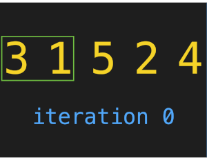
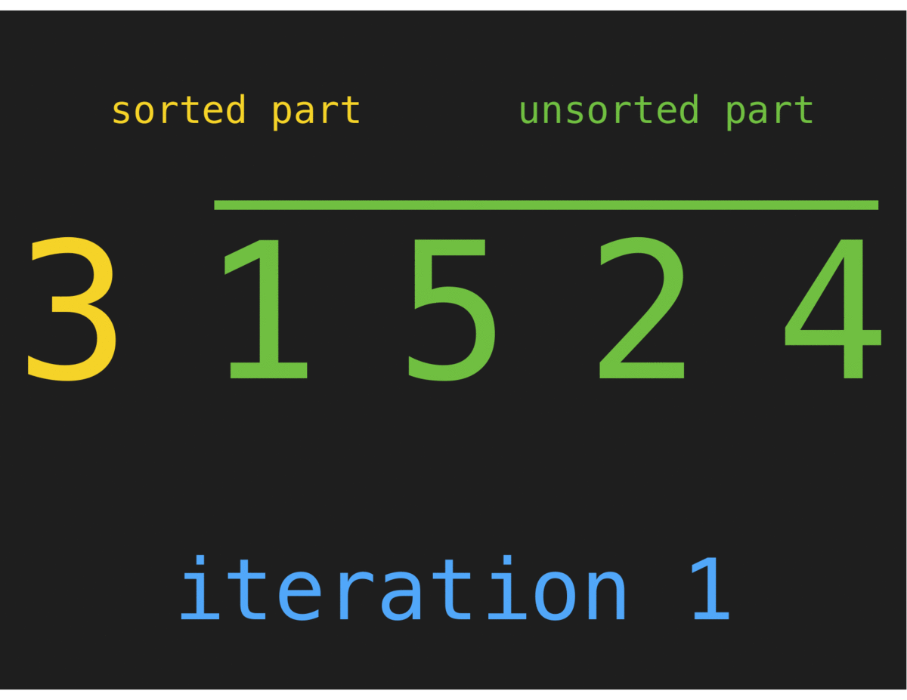
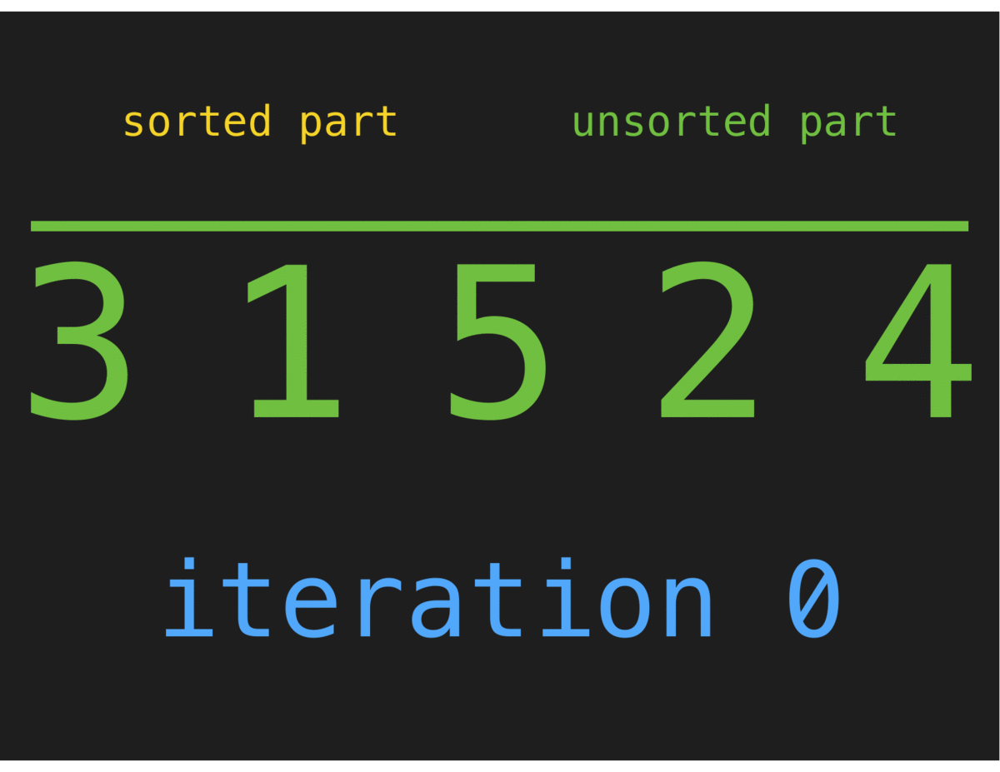

# Lab 3 - Basic Sorting


## 1. Introduction

Welcome to Lab 3! Today we'll be covering various basic sorting algorithms to get you accustomed to writing simple algorithms. We will be going over Sections 2 & 3 together before splitting off into separate groups to complete the lab.

1. [Introduction](#1-introduction)
2. [Pointers and References](#2-pointers-and-references)
3. [Bubble Sort](#3-bubble-sort)
4. [Insertion Sort](#4-insertion-sort)
5. [Selection Sort](#5-selection-sort)
6. [Submission](#6-submission)


## [2. Pointers and References](#1-introduction)
Pointers & references can be a bit confusing at first in C++ as the language uses the same symbols for multiple operations. For example, the ```*``` symbol can be used to create a pointer, or to de-reference a pointer. Similarly, the ```&``` symbol can be used to create a reference or to obtain the memory address of an existing variable. Hopefully by the end of this lab we will de-mystify this concept and all be comfortable with using them.

To be more efficient, the code we'll be writing passes the vector of elements to be sorted by **reference**. This makes it so we do not need to make multiple copies of the vector (a mistake many of you made on Assignment 1!), as copying a vector is an expensive operation. There are three ways in C++ to pass by reference:

* A pointer ``` int *my_ptr; ```
  * This will create a pointer (memory address) to "point" to the memory address given to it. This pointer can be re-assigned, and pointer arithmetic can be performed on it. To access the data stored in a pointer (de-reference), use the \* operator again.
* A constant pointer ```int * const my_const_ptr;```
* This will create a constant pointer (memory address) to "point" to the memory address given to it. This pointer can NOT be re-assigned & pointer arithmetic can be performed on it. To access the data stored in a pointer (de-reference), use the \* operator again.
* A reference ```int &my_reference```. This creates a "constant pointer" as above, but with automatic indirection. In other words, it automatically de-references for you when needed.

When you pass a variable by reference, you pass the memory address that this variable is located. This makes it so any change made in the function affects the data directly, instead of affecting a copy.

Here is a brief piece of code that showcases a simple usage of a pointer to modify a variable. Feel free to put this into http://www.pythontutor.com/cpp.html#mode=edit to view a visualization. 

```c++
#include <iostream>

int main(){
    int my_var = 5;
    
    // Prints 5
    std::cout << my_var << std::endl;
    
    // Create a "pointer to an integer" called 'ptr'
    int * ptr;
    
    // Obtain the memory address of 'my_var' and store it into 'ptr'
    ptr = &my_var;
    
    // De-reference 'ptr' and change the value stored in that memory address (5) to 10
    *ptr = 10;
    
    // Prints 10
    std::cout << my_var << std::endl;
}

```

Taking that same concept, we can use a pointer to modify a variable even if we are out of scope.

```c++
#include <iostream>

void AddFive(int * ptr);

int main(){
    int my_var = 5;
    
    // Prints '5'
    std::cout << my_var << std::endl;
    
    AddFive(&my_var);
    
    // Prints '10'
    std::cout << my_var << std::endl;
}

void AddFive(int * ptr){
    *ptr += 5;
}
```

Here is this same code with a "constant pointer".

```c++
#include <iostream>

void AddFive(int * const ptr);

int main(){
    int my_var = 5;
    
    // Prints '5'
    std::cout << my_var << std::endl;
    
    AddFive(&my_var);
    
    // Prints '10'
    std::cout << my_var << std::endl;
}

void AddFive(int * const ptr){
    *ptr += 5;
}
```

And once more with a "reference".

```c++
#include <iostream>

void AddFive(int & ptr);

int main(){
    int my_var = 5;
    
    // Prints '5'
    std::cout << my_var << std::endl;
    
    AddFive(my_var);
    
    // Prints '10'
    std::cout << my_var << std::endl;
}

void AddFive(int & ptr){
    ptr += 5;
}
```

Take a look at https://www.geeksforgeeks.org/pointers-vs-references-cpp/ for a little more reading on pointers and references, then answer these questions.

:white_check_mark:Question 1: Which of the three implementation above is the "best"?

:white_check_mark:Question 2: Why is it safer to use a constant pointer over a pointer?

:white_check_mark:Question 3: When would you use a pointer over a constant pointer?

## [3. Bubble Sort](#1-introduction)

The first sort we will cover is "Bubble Sort". This strategy finds the largest element in the collection and "bubbles" it to the right-side of the collection. After each pass *i*, the search space is reduced by 1, as every index to the right of *n - 1 - i* is guaranteed to be sorted. Here is a brief animation showing this strategy in motion.

<p align="center">
  
</p>

```C++
#include <iostream>
#include <vector>

void BubbleSort(std::vector<int> * const vec);
void Swap(std::vector<int> & vec, int indexA, int indexB);

int main(int argc, char** argv) {
    std::vector<int> data{5, 4, 2, 7, 3, 9, 1, 8};

    // Pass the memory address of 'data' to 'BubbleSort()'
    BubbleSort(&data);

    for (int i = 0; i < data.size(); i++) {
        std::cout << data[i] << " ";
    }
    std::cout << std::endl;
}

// 'vec' is a 'const pointer' to a memory address containing a vector
void BubbleSort(std::vector<int> * const vec) {
    // The '->' operator de-references the pointer AND invokes the dot-operator to access the object.
    // Alternatively, you can replace 'vec->size();' with '(*vec).size();'
    int length = vec->size();
    bool swapped = true;

    while (swapped) {
        swapped = false;
        for (int i = 1; i <= length - 1; i++) {
            // De-reference the vector pointer, then invoke the '[]' operator to access a specific element
            if ((*vec)[i - 1] > (*vec)[i]) {
                Swap(*vec, i-1, i);
                swapped = true;
            }
        }
        length--;
    }
}

// The reference operator (&) is used to create a reference variable
// This is a 'const *' (as in BubbleSort() above) but with automatic indirection (it applies the * for you)
void Swap(std::vector<int> & vec, int indexA, int indexB) {
    int temp = vec[indexA];
    vec[indexA] = vec[indexB];
    vec[indexB] = temp;
}

```
:white_check_mark:Question 4: What is the Big-O for the BubbleSort() function above?

:white_check_mark:Question 5: Could this run-time be improved at all without changing the strategy?

## [4. Insertion Sort](#1-introduction)

The idea in insertion sort is similar to sorting cards as they are dealt. Receive the card, find the proper location and place it.
                                        
  Wikipedia 

<p align="left", margin-top=0>
  
</p>

When you receive the first card nothing needs to be done, since no other cards in your hand (it is already sorted). Starting on the second element (second card you receive), look for the right place. If it should go first, you slide the first card to the right and insert the second card in the correct place. Now you receive the third card. If it belongs in the first place you'll shift both cards to the right and will place it in the first position.
This first pseudocode makes it easier to see. 'x' would be the card you are receiving, starting by index 1, since for index 0 there is nothing to be done, then j represents the card right before the one you just received from the dealer. Now you start a while process (while the card in the left is greater than the one received from the dealer - A[j] > x - move to the right) and this process will last until you reach the correct position or the first place (j = 0). Although I say or here it means that either of the conditions when met will stop the while process (represented by 'and' in the code since either of conditions when not valid anymore will stop the while to execute).

Pseudocode of Insertion Sort
```
i ← 1
while i < length(A)
    x ← A[i]
    j ← i - 1
    while j >= 0 and A[j] > x
        A[j+1] ← A[j]
        j ← j - 1
    end while
    A[j+1] ← x
    i ← i + 1
end while
```

The same algorithm just a little bit different.

```
i ← 1
while i < length(A)
    j ← i
    while j > 0 and A[j-1] > A[j]
        swap A[j] and A[j-1]
        j ← j - 1
    end while
    i ← i + 1
end while
```

:white_check_mark: Question 6: Are these 2 implementations doing the same work?

:white_check_mark: Question 7: Implement these algorithms in C++.

Here is a video to help with visualizing how Insertion Sort works: https://www.youtube.com/embed/ROalU379l3U

:white_check_mark: Question 8: Now that you understand Insertion Sort well, implement its recursive version.


## [5. Selection Sort](#1-introduction)


The idea in Selection sort is to keep track of the index for the lower value. Starting at index 0 the algorithm then compares the value at this index with the value of the rest os indexes in the array, if it finds a value lower than the currently value it will keep track of its position and at the end will swap the values to put the lower value at index 0. Next you hold position 1 and compare to the rest of the array and hold whichever index refers to the lowest value in the array and swap to put the new lowest value in position 1 and so on.


<p align="left">
  
</p>

Pseudocode for Selection Sort
```
for (i=0; i < (length - 1);i++) {
    min-value-index = i;
    for(j=i+1; j < length;j++) {
        if(arr[min-value-index] > arr[j]) {
            min-value-index = j;
        }
    }
    swap(arr[i], arr[min-value-index]);
}
```

:white_check_mark: Question 9: Implement a function ```selectionSort(double &arr, bool reverse);``` that will execute Selection sort when argument reverse is false. When reverse is true it should produce a reverse sorted array (using the same principles as selection sort).


## [6. Submission](#1-introduction)

You will submit your lab-3.cpp file that contains your code solutions & answers.txt that contains your answers to all questions to Gradescope.
