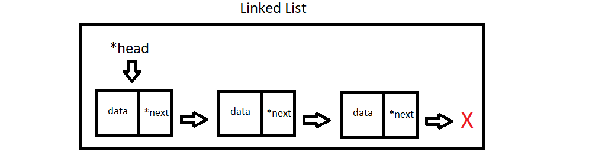
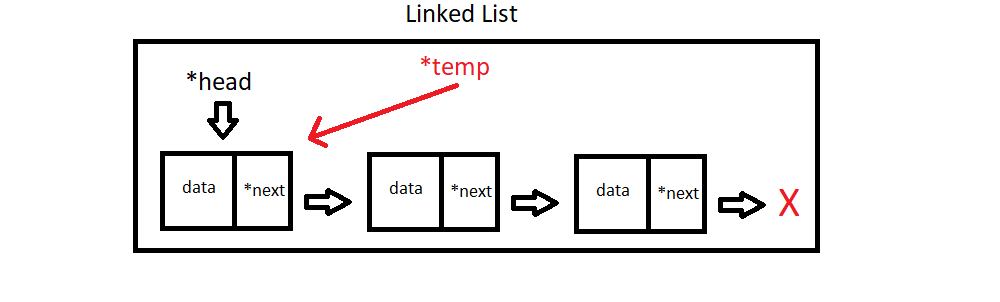
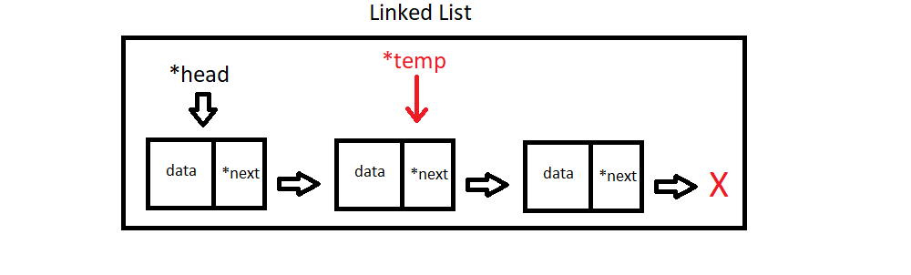
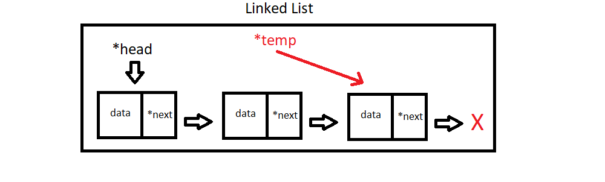
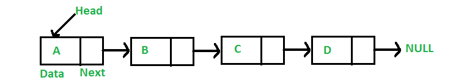
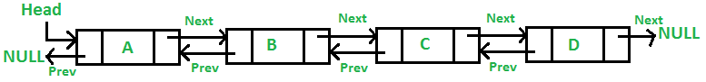
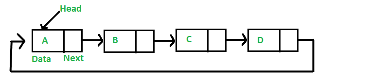
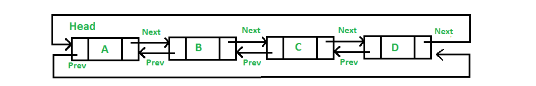

# Lab 04: Linked Lists

## 1. Introduction 
Today you will implement a singly-linked list as discussed during this week's lecture. 

1. [Introduction](#1-introduction)
2. [Pointer Review](#2-pointer-review)
3. [Visualizing Linked Lists](#3-visualizing-linked-lists)
4. [Visualizing SLL Operations](#4-visualizing-sll-operations)
5. [The Assignment](#5-the-assignment)
6. [Submission](#6-submission)

## [2. Pointer Review](#1-introduction)

Feel free to review [Section 2 of last week's lab](https://github.com/URI-CSC/212-fall-2020/tree/master/labs/lab-3#2-pointers-and-references) for a review on pointers if needed. Once you are able to answer the following questions, you can feel comfortable moving on.

:white_check_mark:Question 1. What is the difference between "pass-by-value" and "pass-by-reference"?

:white_check_mark:Question 2. In your own words, what is the difference between a 'pointer', a 'const pointer', and a 'reference'?

:white_check_mark:Question 3. What are the pros & cons of passing by reference?

## [3. Visualizing Linked Lists](#1-introduction)
We'll start with a brief introduction to Linked Lists & a brief description of the types of Linked Lists.

### The Node Class

Linked Lists are your first introduction to a dynamically resizing data structure that does **not** involve a copy operation. A Linked List is only ever as large as it needs to be. Unlike an array, data does not get stored directly into any primitive storage container. Instead, we utilize a second concept called the `Node`. Each `Node` contains the data it is storing, as well as a pointer(s) to neighboring nodes, with the amount of pointers depending on the type of Linked List being implemented. This class is meant to be very simple; each `Node` object holds data and pointer(s) to other `Node` objects. Aside from constructors, getters & setters are all you need to add to the `Node` class.

### The Linked List Class

In a Linked List,`Nodes` are *linked* together to form a data structure, hence the name. The primary goals of the LinkedList class are to provide an entry point into the data structure (the `head pointer`) and facilitate traversal, insertion, deletion, etc. The Linked List class contains a `head pointer`, as well as any utility functions that should operate on the structure (some are listed below.)

:white_check_mark:Question 4. What are some of the strengths & weaknesses you can come up with for this type of data structure?

### Linked List Traversal

For many operations, we will be required to traverse the Linked List in order to get to the location we plan to perform an operation on. A quick reminder on going about this task; **you can not move the head pointer!** If you do, you will lose access to all of the data in your list. Instead, we make use of a temporary pointer.

> We start by creating a temporary pointer and making the assignment `temp = head`, so both `head` and `temp` point to the same location in memory (the first `Node`.)

> To advance our temporary pointer, we use `temp = temp.next`. `temp.next` obtains the memory address of the `Node` pointed to by `temp`, and the assignment operator makes `temp` point to it.

> This process repeats until some terminating condition is met. This condition will depend on the operation you are performing.

:white_check_mark:Question 5. What are some possible terminating conditions you can think of for various operations you may perform on this data structure?

### Singly Linked List

> Each node (pair of boxes) contains data (in this case integers), and a pointer to the next node. 
> There is also a `head` pointer, which should always point to the first node in the linked list as long as operations are not currently being performed on it (i.e, "the `head` pointer points to the first node" is an *invariant* of a singly linked list).

### Doubly Linked List

> Each node (triad of boxes) contains data (in this case integers), a pointer to the next node, *and* a pointer to the previous node.
>
> The `head` node's `prev` points to `nullptr`.
> There is also a `head` pointer, which should always point to the first node in the linked list as long as operations are not currently being performed on it (i.e, "the `head` pointer points to the first node" is an *invariant* of a doubly linked list).

### Circularly Singly Linked List

> Each node (pair of boxes) contains data (in this case integers), and a pointer to the next node. This time, the final node points back to the head node.
>
> There is also a `head` pointer, which should always point to the first node in the linked list as long as operations are not currently being performed on it (i.e, "the `head` pointer points to the first node" is an *invariant* of a circularly singly linked list).

### Circularly Doubly Linked List

> Each node (triad of boxes) contains data (in this case integers), a pointer to the next node, *and* a pointer to the previous node.
>
> The `head` node's `prev` points to the last element, and the last element's `next` points to `head`.
> There is also a `head` pointer, which should always point to the first node in the linked list as long as operations are not currently being performed on it (i.e, "the `head` pointer points to the first node" is an *invariant* of a circularly doubly linked list).

:white_check_mark:Question 6. Think of a use case for each of these types of linked lists.

## [4. Visualizing SLL Operations](#1-introduction)

To begin our journey of fully understanding the inner-workings of linked lists, we will start by coding the simplest of the bunch: the singly linked list. Below are some visual representations for basic operations.

### push_front

> As we already have access to the head of the list, push_front is rather easy to implement. Simply create a new node, assign its 'next' to head, and assign head to the new node!

### push_back

> We'll need to do a bit more work to insert at the end of the list. Seeing as we only have access to 'head', we'll need to create a temp pointer that points to 'head', then traverse until we reach the end of the list.

:white_check_mark:Question 7. What is the condition to use in a while loop that will get us to the last node in the list? Note: if we reach `nullptr`, we've gone too far!

### insert

> Similar to push_back, we need to traverse the list until we arrive at a particular location. Except this time, we don't just traverse until the end; we need to keep count of what "index" we are at in order for the function to work as intended.

:white_check_mark:Question 8. What is the condition to use in a while loop that will get us to the correct location to perform insertion?

### delete

> Deletion is a trickier operation than any of the inserts, as you'll need to use *two temp pointers* to complete this operation. Their final state is given above if 'C' were being deleted. You'll need to move the pointers together, and `prev` should trail `tmp`

:white_check_mark:Question 9. What is the condition to use in a while loop that will get us to the correct location to perform deletion?

## [5. The Assignment](#1-introduction)

Your task is to create both a LinkedList class that utilizes a Node class that stores integers, and performs the following tasks:

- push_front
  - Adds an integer to the front of the list
- push_back
  - Adds an integer to the end of the list
- insert
  - Adds an integer to the list at a specific index
- delete
  - Searches for & removes a specific element in the list
- contains
  - Returns true if the given value exists in the list. False otherwise.
- size
  - Returns the # of elements in the list
- to_string
  - Returns all elements in the list concatenated into a single string.
    The list 5 -> 3 -> 4 -> 2 would return "5 3 4 2"

## [6. Submission](#1-introduction)

You should submit the following files:

- linked-list.h
- linked-list.cpp
- node.hp
- node.cpp
- main.cpp
- answers.txt (this file contains any answers to non-coding questions in this lab)
