# Lab 07: Backtracking

## Introduction

Recursion is the practice of breaking a complicated problem down into small, trivially solvable pieces, and then merging those pieces together to solve the full problem completely. Recursive backtracking however, takes this process to the next level. This method will allow us to discard incorrect pieces & attempt to re-solve that part of the problem with different parameters.

## A Lesson on Backtracking

Backtracking is a systemic method to iterate over all possible configurations of a search space. The general idea is:

```
0.) Is the task complete? Return true if so.
1.) At any given step, enumerate all possible actions.
	1.2.) Make one of the enumerated actions
	1.3.) Evaluate the new partial solution. If we obtain 'True', also return 'True' else try a different action
2.) If we run out of moves, return 'False' to backback to a previous stage of the problem
```

This strategy can be applied to many problems, and as such represents a 

Let's take a look at an example; solving a game of Sujiko! 

The purpose of this game is to place the numbers 1-9 on the board such that the sum of the four numbers around a circle equal the number in a circle. How would you solve this puzzle?

<p align="center">
  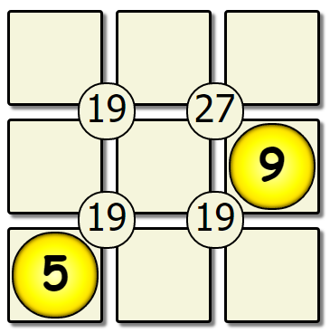
</p>

Lets take a look at an algorithm:

```
0.) Is the win condition met? If so, return true. Otherwise, continue on.
1.) At any given step, record all of the missing values.
	1.2) Place the first missing value into the first open spot on the board.
	1.3) Recursively call this function with the new board. If we obtain True, also return True. 
	     Otherwise, replace the number with the next missing value.
2.) If we tried all of the missing values & none worked, return False so the previous version of this board can try another number.
```

Lets try applying this algorithm to our board:

| First Pass                               | Second Pass                               | Seventh Pass                               |
| ---------------------------------------- | ----------------------------------------- | ------------------------------------------ |
| 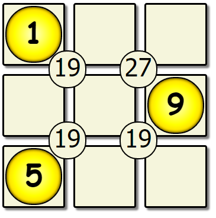 | 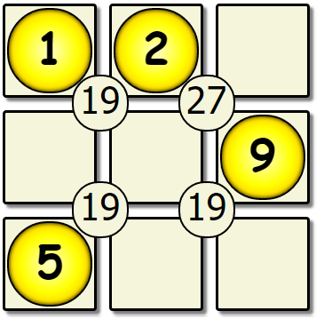 | 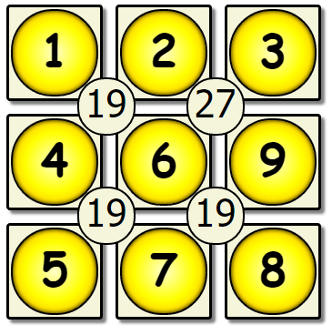 |

We've hit our first dead end, & there are no more missing values to place. This solution is not correct, so we backtrack to the previous version of the board, and change the number that was placed.

| Sixth Pass Revisited                               | Sixth Pass Modified                               | Seventh Pass Revisited                         |
| -------------------------------------------------- | ------------------------------------------------- | ---------------------------------------------- |
| 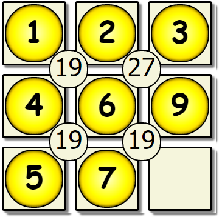 | 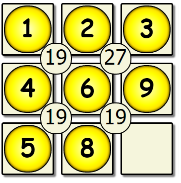 | 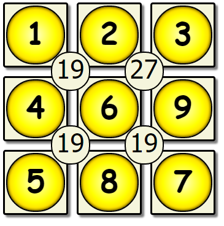 |

This yields another dead end, so we would backtrack back to the 5th empty spot, and change the value there.

| Fifth Pass Revisited                               | New Fifth Pass                               | New Sixth Pass                               |
| -------------------------------------------------- | -------------------------------------------- | -------------------------------------------- |
| 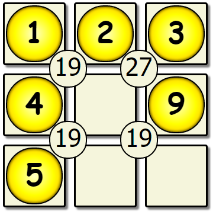 | 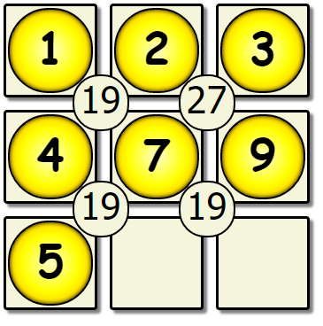 | 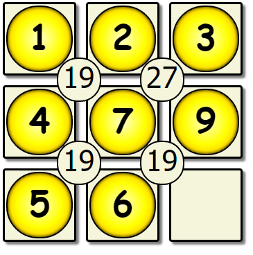 |

This process would repeat until we have a solution board:

<p align="center">
  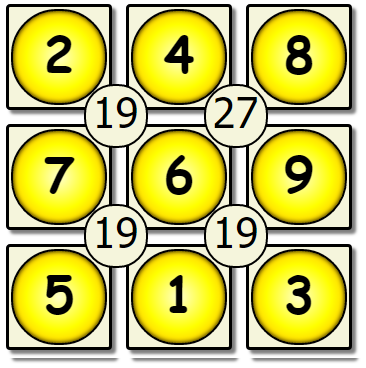
</p>

## 1. N-Queens Problem

The N-Queens problem is the task of placing eight chess queens on an NxN chessboard such that no two queens can attack each other. Let's take a look at this empty 8x8 chess board:

<p align="center">
  
</p>

How would you solve the problem? Let's take a look at pseudocode for the strategy you would probably use.

```
1) Start in the leftmost column
2) If all queens are placed
    return true
3) Try all rows in the current column. 
   Do following for every tried row.
    a) If the queen can be placed safely in this row 
       then mark this [row, column] as part of the 
       solution and recursively check if placing
       queen here leads to a solution.
    b) If placing the queen in [row, column] leads to
       a solution then return true.
    c) If placing queen doesn't lead to a solution then
       unmark this [row, column] (Backtrack) and go to 
       step (a) to try other rows.
3) If all rows have been tried and nothing worked,
   return false to trigger backtracking.
```

> During lab we went over a step-by-step visualization for this problem. If you missed it (or need a refresher) you can view a simulation here: https://www.cs.usfca.edu/~galles/visualization/RecQueens.html

The following is the result of the recursive call tree for solving a 4x4 puzzle.

<p align="center">
  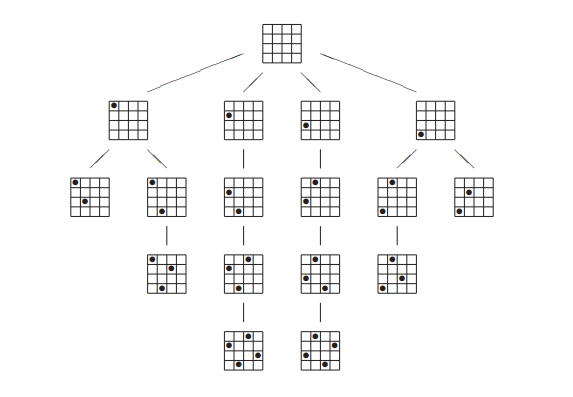
</p>

The code to solve the N-Queens problem is given in this lab. Download the code & work to understand how the backtracking is working to solve the problem. After you can follow the code, move on to the next section.

## 2. Sudoku!

If you are yet unaware of what a Sudoku puzzle is, you are given a partially filled 9x9 board with the objective of filling each cell such that each row, column, and 3x3 subgrid contains all of the digits 1-9. You can **not** change the given values. As an example, here is a puzzle:
	
|            Sudoku Puzzle             |            Sudoku Puzzle Solved             |
| :----------------------------------: | :-----------------------------------------: |
|  | 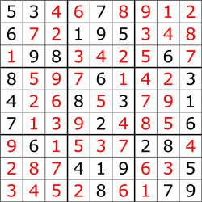 |

Now that you know the rules, finish the given code for solving a Sudoku puzzle.

Your strategy will be *very* similar to the solution for N-Queens:

```
1) If we have filled the entire board,  return true
2) For each digit 1-9:
	- If this digit can be placed in this cell
		- Place the digit
        - Recurse to the next empty cell.
        - If that recursive call returns true
            - Return true
        - else
            - Try the next digit
3) If none of the digits yielded a valid solution, backtrack.
```

Before starting the code for this problem, work through a few rounds on paper to ensure you have the correct methodology.

## 3. Re-N-Queens: A different perspective

In the given solution for N-Queens, the puzzle is solved by changing the row a Queen is placed on in a given column.

Write a function that instead solves the puzzle by changing the column a Queen is placed on in a given row.

In other words, instead of solving the puzzle left to right, solve it top to bottom.

## 4. Submission

Submit all of your source code created to solve all problems.
