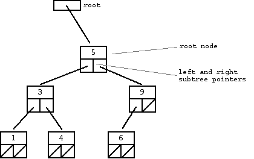

# Lab 9: Binary Search Trees 


## 1. Introduction

Today you will be creating and implementing a Binary Search Tree given just a header file and a strict specification for each component of the class. 
This may sound intimidating, but do not be alarmed, for as long as you take each part bit-by-bit you should have no trouble getting through at least the majority of the lab.
On the bright side, you don't have to write any code to test your implementations, since we're giving you unit tests using doctest for all of the methods you will need to implement. 
That being said, **you must adhere to the specifications, otherwise the unit tests will not work. This includes method names.**

The purpose of this lab is not only to help you understand the binary search tree data structure, but to give you experience with creating implementations given a specification, which is an invaluable tool to have in your arsenal. 
Not only will you be required to solve a problem or implement a task based on specifications in later classes, but also in virtually any software engineering job and likely most other jobs which involve programming.

## 2. Binary Search Trees

A binary search tree is a data structure to store arbitrary "items" in a way that allows extremely rapid searches, insertion, and removal. 
They rely on sortable "keys" which are used to store and look up a given node.
These "keys" and the way they are stored means that during a lookup, at each step, up to half of the entire tree can be discarded from the search. 





As you can see from the image above, a Binary Search Tree is ordered in the following way:

* A root node pointer which always points to the initial value
* Each node has a left pointer and a right pointer
    + The **left** pointer points to a node whose key is **less** than the parent node's key
    + The **right** pointer points to a node whose key is **greater** than the parent node's key 
* This pattern continues throughout the BST

The resulting tree will have two subtrees stemming from the root node. The left-hand subtree will have key values which are all less than the root node's key. The right-hand subtree will have key values which are all greater than the root node's key.

Check out this binary search tree visualization from USFCA: [Visualization](https://www.cs.usfca.edu/~galles/visualization/BST.html)

## 3. The Starter Code

This lab is a bit different compared to previous labs in that you will be exposed to some new concepts. 
To be more specific, we give you a makefile, a unit test file, a doctest header file and a header file with class definitions for `BSTNode` and `BSTree` classes (plus a couple other things). 
We have supplied ```bst.cpp``` to house your class definitions, and `test.cpp` will serve as your main file. 
Thus you will need to follow the specifications in the next section very closely in order to complete the lab correctly.

### The BST Header

If you take a look into `bst.h`, you will notice that it has been pre-written for you. It also contains some code you've likely never seen before, like the following: 


```c++
#ifndef MAX
#define MAX(a,b) ((a > b) ? a : b)
#endif
```

Similarly to the preprocessor directive defining `NULL`, this statement defines a macro which actually takes arguments. 
This allows the preprocessor to replace any instance of `MAX(a,b)` with `((a > b) ? a : b)`, which is just a convenient way of getting the max of two numbers, `a` and `b`, without even needing to create a function.

All that remains then is the class definitions. 
For the sake of completeness, `BSTNode` is the class which will be used for each node of the tree, and `BSTree` is the class for the tree itself. 
What you actually need to do with these classes will be explained in the next section.

### The Makefile

While you don't necessarily need to know how it works, this file is what you will use for both compiling *and* running your code. 
The nice thing about a makefile is that if it is created correctly, all you need to do to compile your code is run the command `make`, no arguments needed. 
While this is the typical, most basic usage of a makefile, the makefile you are given goes one step further and runs your program immediately after compiling and then removes the binary it created. 

Again, all you need to do is run `make`.

However, do be aware that until you have filled in your header file properly, your program will fail to compile and run. 
You should only concern yourself with trying to compile the program after implementing the contents of your header. 
Once you do, your program will compile, but it will still fail all of the tests. 
This is the point at which you should move on to implementing the methods.

### The Unit Tests

The unit tests for this lab, found in `test.cpp` will perform various tests on each of your method implementations, giving you some feedback if a test fails. 
You shouldn't need to do anything with this file, but you're welcome to create additional test cases.
### The Doctest Header

Don't worry about `doctest.h`; for our purposes, it is magic. 

## 4. Instructions

**Be sure to read Sections 4.1 and 4.2 before starting** 

Your goal for this lab is to complete the following tasks **in order**:

1. Implement the first method you haven't implemented yet
    1. If you are working on `insert()` you should implement `height()` as well before moving on
4. Compile and run your program. If it does not pass all the tests for that specific method, debug your implementation. If it does, continue on
5. If there are methods still remaining, go back to step 1

### 4.1 Class Contents

Aside from putting in the methods declarations, which will be explained in more detail below, you have the following to make your classes work properly:

In BSTNode:

+ An integer for storing the node's data (private)
+ A pointer to the node's left child (private)
+ A pointer to the node's right child (private)
+ A constructor that takes an integer to be stored in the data variable (public)
+ An empty destructor (public)
+ The BSTNode should also give the BSTree class permission to modify its private data members

In BSTree:

+ A pointer to the root node (private)
+ All of the methods specified in Section 4.2 below

### 4.2 Methods

#### Constructor and Destructor

The constructor should take no parameters and initialize the root variable with an appropriate value. In other words, it should create an empty tree.

The destructor should delete the entire tree, which is an operation best performed recursively. 
However, destructors in C++ cannot be recursive. 
The solution to this predicament is to use a private helper method, `destroy()`, which will be described in further detail below. 
The destructor should just call `destroy()`, passing in the root node pointer.

> Note: A common theme in many of these methods is to have a public, non-recursive method which simply calls a private, recursive function on the root node. 
> This is because a binary search tree can be traversed or searched easily by calling a recursive method on a node's left child, right child or both. 
> In fact, due to a concept called *function overloading*, these methods can have the same name so long as they have different parameters.

It is recommended to work on these methods in order and test them using `make` before moving on to the next.
#### Insert

You should create two methods named `insert()`, one which takes an integer and returns nothing, and the other which takes a `BSTNode *` and an integer and returns a `BSTNode *`. 
The first method is the public method, which the user will be able to call, and the second method is the private recursive method which actually inserts the node in the correct place in the tree.

#### Height

Again, create two methods named `height()`, one private and one public. 
The public method should take no parameters, call the private method on the root, and return the resulting integer representing the height of the tree. 
The private method should take a `BSTNode *` parameter and return an integer representing the height of the subtree rooted at the node passed in.

> Note: Calling the height method on an empty tree should return -1 as a tree with one node is of height 0. This is meant to distinguish between the two.

#### Traversals

Here you will need six methods in total:

1. Two `preorder()` methods: one private and one public
2. Two `inorder()` methods: one private and one public
3. Two `postorder()` methods: one private and one public

Each public method should take the line `std::ostream& os = std::cout` as a parameter and return `void`, simply calling the private counterpart with the root node pointer and the `ostream`.

Each private method should take a `BSTNode *` and a `std::ostream&` as parameters and return `void`, performing the traversal specified by its name.

The `ostream` is needed solely for testing, but you can also think of it as a generalization of printing. 
Instead of writing data to STDOUT using `std::cout`, you will instead write to the `ostream` passed in as an argument. 
Thus, when you visit each node, you should write its data to the `ostream` just as you would with `cout`, including the `std::endl`.

As for the parameter `std::ostream& os = std::cout`, this allows you to call the method without passing in an `ostream`, in which case the method will use `cout` by default.

Essentially, calling the method as `traversal()` will default to using `std::cout`, and outputting as `os << "anything"` will work exactly as you'd expect `std::cout << "anything"` to work.

#### Destroy

You should create a destroy function which is private and takes a node and returns void. 
It should destroy the entire subtree starting at node recursively.

> Ensure that you only delete your current node after all subtrees have been freed.
> Think about which type of traversal would be best to implement this method.

#### Search

You should create a public search method which takes an integer and returns a boolean indicating whether or not the node was found. 
It should search the tree recursively and return true if and only if the value is found, false otherwise.

### 4.3 Hints

+ The unit tests for `insert()` and `height()` rely on one another, so they both need to be implemented correctly before you can pass either method's test cases.

## 5. Submission

Your submission to this lab will be the code that you create. In particular the `bst.h` and `bst.cpp` files. 
You can also submit your test file if you make any additions, but you shouldn't remove any tests.

